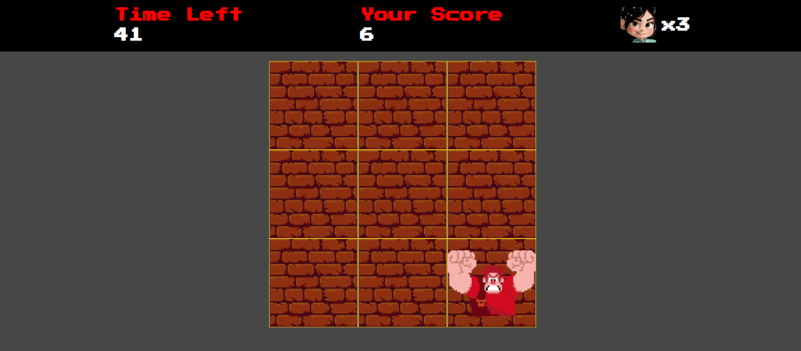

<h1 align="center">DetonaRalph Game</h1>

  
Jogo inspirado no Detona Ralph desenvolvido durante o bootcamp Potência Tech iFood - Desenvolvimento de Jogos da DIO

  

<h2>Conceitos Desenvolvidos</h2>

  

    
    
    
  

  <ul>
    <li>Estruturação do Projeto</li>
    <li>Produtividade com Emmet</li>
    <li>Objetos JS</li>
    <li>Variáveis View, Values e Actions</li>
    <li>forEach</li>
    <li>Listeners</li>
  </ul>

